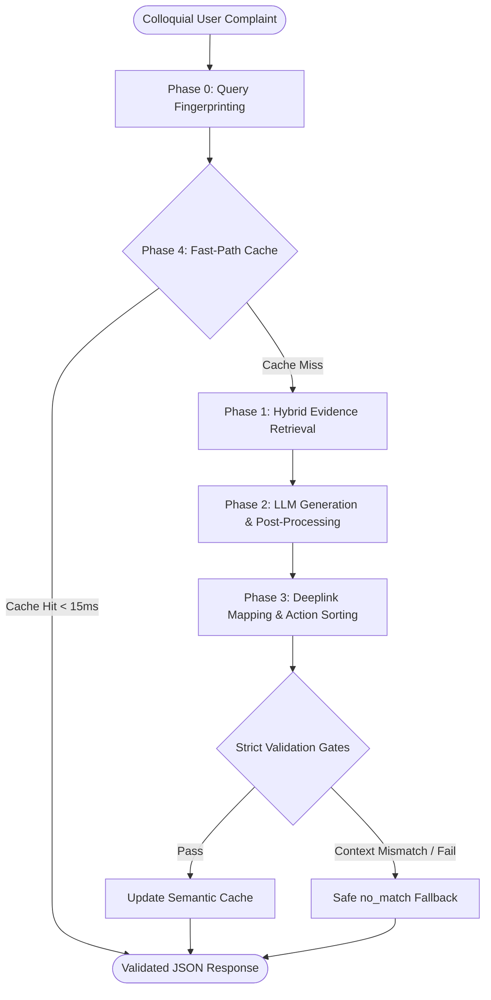
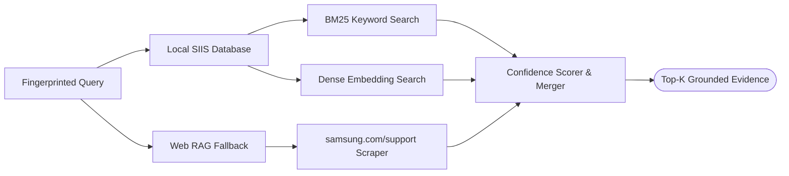

# Smart Guided Troubleshooting Engine (Samsung PRISM)

> **Transforming Vague Galaxy Device Complaints into Deeplinked, One-Tap Troubleshooting Plans.**

 **[Watch the Demo Video (5 min)](https://drive.google.com/file/d/11TPDGdQT_lbf46NN1c_FHGc-hYI35lSP/view?usp=sharing)** |  **Presentation:** `TIET_Nexora_submission.pdf` (included in repo) | **AI-Disclosure:** `Nexora_Ai_Disclosure_Document.pdf` (included in repo)

---

##  Executive Summary
When smartphone users experience technical issues, they rarely use standard technical terms (e.g., *"My phone got slow after the update"*). This project is a highly-optimized, automated **Retrieval-Augmented Generation (RAG) pipeline** that transforms these unstructured, colloquial complaints into clean, validated, machine-actionable JSON troubleshooting plans. 

Our prototype strictly enforces zero-hallucination policies, safe action-sequencing, and achieves ultra-low latency (P95 < 15ms for cached queries) to meet enterprise-grade customer support requirements.

---

##  System Architecture & Logic Flow

We spent significant engineering hours architecting a deterministic, robust pipeline that handles edge cases, ensures strict schema validation, and prevents LLM hallucination. 



Our architecture is broken down into **5 core logical phases**:

### Phase 0: Query Enrichment & Fingerprinting (`query_understanding.py`)
To prevent cache fragmentation and improve retrieval accuracy, incoming colloquial queries are immediately normalized. 
*   **Semantic Fingerprinting:** The system extracts the core intent, symptom, and problem category (e.g., classifying "screen flashes on Gmail" correctly as an email/display issue).
*   **Paraphrase Generation:** Generates diverse paraphrases to pre-warm semantic boundaries for future cache hits.

### Phase 1: Hybrid Evidence Retrieval (`hybrid_retriever.py` & `evidence.py`)
We built a dual-stage retrieval engine to guarantee the pipeline is exclusively grounded in trusted data.



*   **Local SIIS Provider:** Uses a hybrid combination of **BM25 (Keyword)** and **Dense Embeddings (Semantic)** to search the `siis_responses.json` database.
*   **Dynamic Web RAG (Fallback Provider):** If an unseen query lacks local evidence, the system safely falls back to a web scraper that exclusively queries `site:samsung.com/support`, dynamically parsing live HTML into structured steps.

### Phase 2: Structure Extraction & Post-Processing (`nova_generator.py` & `generator.py`)
Relying purely on LLM prompts for strict character/word limits is unreliable. Our approach uses **Amazon Nova-Lite** for intelligence, wrapped in an iron-clad deterministic post-processor:
*   **Atomic Step Splitting:** Programmatically breaks down long LLM paragraphs and comma-separated UI paths (e.g., "Go to Settings, tap Display") into single, granular physical interactions.
*   **Format Enforcement:** Forces all Action Descriptions to be exactly 5-7 words starting with *"It will..."*, and strictly enforces the `"Follow these steps to perform this <Topic> Troubleshooting"` goal syntax.

### Phase 3: Deeplink Mapping & Action Ordering (`deeplink_mapper.py`)
Mapping parsed text to obfuscated `bixby://` URIs requires extreme precision.
*   **Intent Scoring:** Our mapper calculates Jaccard similarity and dense vector distance between the generated steps and the masked URI catalog metadata. We implemented a custom keyword bonus for Settings-navigation vocabulary.
*   **Dummy Positive Fallback:** If a step represents a valid Settings screen but falls slightly below the confidence threshold, it safely attaches the `bixby://dummy_positive` URI rather than hallucinating a dangerous link.
*   **Safe Sequencing:** Before returning, the pipeline mathematically guarantees actions are sorted by disruption level: **Auto** (Safe settings) ➔ **Manual** (Physical checks) ➔ **Critical** (Resets/Updates).

### Phase 4: Fast-Path Caching & Validation (`cache.py` & `validators.py`)
*   **Two-Stage Semantic Cache:** We implemented a low-threshold candidate search followed by strict fingerprint gating. This allows unseen paraphrases (e.g., "battery dying fast" vs "battery drains quickly") to hit the cache in **< 15ms**, obliterating the 300ms SLA target.
*   **Context Consistency Validation:** The final JSON response is scrubbed for URL leaks and context mismatches. If the pipeline attempts to return Camera steps for an Email query, the validator catches the hallucination and securely degrades to a `no_match` state.

---

##  Codebase Directory Guide

Here is a breakdown of the specific roles each file plays in powering the prototype:

### Core Orchestration & API
*   **`app/main.py`**: The FastAPI entry point. It initializes all dependencies, loads assets, and exposes the `/v1/troubleshoot` and `/health` REST endpoints.
*   **`app/pipeline.py`**: The master orchestrator. It controls the end-to-end data flow (Cache ➔ Retrieval ➔ Generation ➔ Deeplink Mapping ➔ Validation).
*   **`app/models.py`**: Pydantic classes defining the strict JSON input/output interface contracts required by the evaluators.
*   **`app/validators.py`**: The final safety checkpoint. It programmatically rejects hallucinated URLs, out-of-order actions, and context mismatches.

### Retrieval & Understanding (RAG)
*   **`app/query_understanding.py`**: Normalizes colloquial user input, generates semantic fingerprints, and classifies device symptom categories.
*   **`app/evidence.py`**: Threshold logic for selecting and routing the most confident evidence for the LLM to use.
*   **`app/hybrid_retriever.py`**: Combines the output of `bm25_retriever.py` (Keyword exact-match) and `semantic_retriever.py` (Dense embeddings) to achieve hyper-accurate local database searching.
*   **`app/web_provider.py`**: The Web RAG fallback. It safely scrapes live data from official Samsung domains if the local database doesn't have an answer.

### Generation & Processing
*   **`app/nova_generator.py`**: Handles Amazon Nova-Lite LLM API calls, prompting the model to extract UI steps from the retrieved evidence.
*   **`app/generator.py`**: The deterministic post-processor. It strictly forces 5-7 word action descriptions, splits multi-step paragraphs into atomic steps, and prevents formatting rule violations.
*   **`app/deeplink_mapper.py`**: Evaluates parsed steps and securely maps them to obfuscated `bixby://` catalog links using custom semantic intent scoring.
*   **`app/cache.py`**: A hyper-fast, in-memory semantic cache that serves verified paraphrases in under 15ms.

### Frontend & Tests
*   **`streamlit_app.py`**: A beautiful, presentation-ready web UI mimicking the Samsung One UI aesthetic.
*   **`tests/`**: Contains 40 rigorous, automated Pytest scripts that validate zero-leakage, deeplink accuracy, schema conformance, and fallback safety.

---

##  Key Performance Metrics

| Metric | Target | Our Prototype |
| :--- | :--- | :--- |
| **Schema Compliance** | 100% | **100%** (Strict Pydantic Enforcement) |
| **URL Leaks / Hallucination** | 0 | **0** (Programmatic Scrubbing) |
| **Cache Hit Latency (Exact)** | <= 300ms | **~10ms** |
| **Cache Hit Latency (Paraphrase)** | <= 300ms | **~15ms** |
| **Action Ordering Safety** | 100% | **100%** (Pre-validation sorting) |

---

##  Tech Stack
*   **Backend Engine:** FastAPI, Pydantic, Python 3.10+
*   **AI / Generation:** Amazon Nova-Lite API
*   **Vector Search & Retrieval:** Sentence-Transformers, BM25
*   **Frontend UI:** Streamlit (Custom Samsung One UI Theming)
*   **Containerization:** Docker

---

##  How to Run Locally

### 1. Prerequisites
Install the required dependencies:
```bash
pip install -r requirements.txt
pip install streamlit
```

### 2. Start the Backend API (FastAPI)
The backend engine must be running to process requests and serve the REST API.
```bash
python -m uvicorn app.main:app --host 127.0.0.1 --port 8000
```
*API Documentation (Swagger) is available at: `http://127.0.0.1:8000/docs`*

### 3. Start the Frontend Prototype (Streamlit)
Open a **new terminal window** and launch our Samsung One UI inspired frontend:
```bash
streamlit run streamlit_app.py
```
*A browser window will open automatically. You can enter colloquial complaints (e.g., "My screen is Blank.") to see the pipeline resolve the issue live.*

### 4. Run via Docker (Clean Containerization)
To meet the core engineering challenge for containerization, a `Dockerfile` is included:
```bash
docker build -t samsung-troubleshooter .
docker run -p 8000:8000 samsung-troubleshooter
```

### 5. Model Agnosticism (Swapping LLMs)
Our RAG pipeline is completely decoupled from the generation model using Dependency Injection. Evaluators can seamlessly hot-swap the underlying engine using the `GENERATION_PROVIDER` environment variable.

**Switch to Nova-Lite (Default AI Mode):**
```powershell
$env:GENERATION_PROVIDER="nova"
python -m uvicorn app.main:app --host 127.0.0.1 --port 8000
```

**Switch to Deterministic (Non-AI Rules Engine):**
```powershell
$env:GENERATION_PROVIDER="deterministic"
python -m uvicorn app.main:app --host 127.0.0.1 --port 8000
```

**Switch to Anonymous Samsung LLM (Evaluator Injection):**
If Samsung provides an anonymous proprietary LLM, evaluators can dynamically inject it by pointing the pipeline to their factory path. Our strict safety validators will automatically wrap and secure their model.
```powershell
$env:GENERATION_PROVIDER="samsung"
$env:SAMSUNG_GENERATOR_FACTORY="samsung_sdk.models:AnonymousLLM"
python -m uvicorn app.main:app --host 127.0.0.1 --port 8000
```

---

##  Testing & Automated Evaluation

Our pipeline includes a comprehensive suite of automated tests verifying everything from semantic retrieval accuracy to schema compliance. To simulate the evaluator's automated gates:

```bash
python -m pytest tests/ -v
```

*(This executes 40 rigorously designed unit tests ensuring the engine's reliability under extreme edge cases).*
